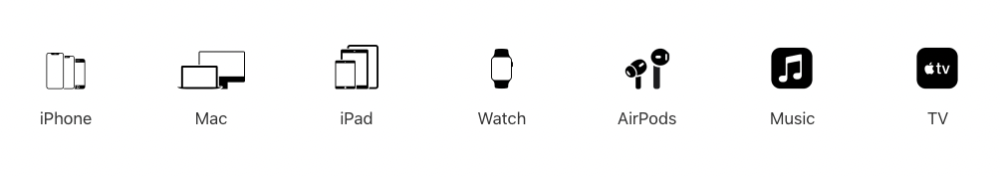
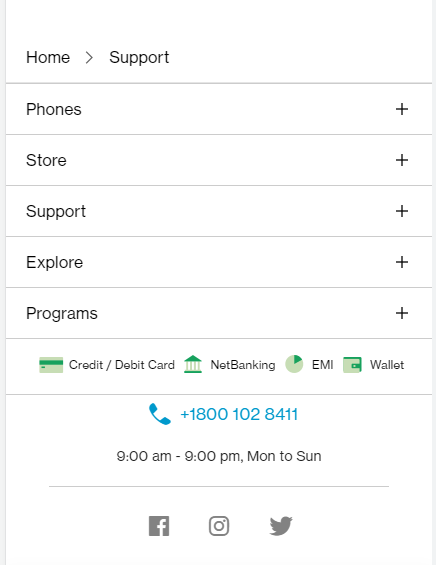

# Dom Manipulation Assignment


## 1. Webiste Name: [Dev To](https://dev.to/)


### Tasks
     Target the Top description div and change the DEV Community to <Your_Name> and description to your passion

### Solution
```javascript
document.querySelector(".side-bar .crayons-card h2").innerText = "Subham Sahu | Front End Developer"
```
### Output


## 2. Website Name: [Apple](https://support.apple.com/en-in)



### Task
     Fetch all the product name and store in an array

### Solution
```javascript
const productList = document.querySelectorAll(".as-imagegrid-item")

productList.forEach((node) => 
     console.log(node.innerText.replace('Support', ''))
)
```

### Output


## 3. Webiste Name: [Youtube Support](https://support.google.com/youtube/)


### Tasks

     Add another FAQ 'My New FAQ' to the list

### Solution
```javascript
const allFAQs = document.getElementsByClassName("accordion-homepage")[0]

const faqHeading = document.createTextNode('h3') 
faqHeading.innerText = "My New FAQ"

const newFAQBar = document.createElement('section')
newFAQBar.setAttribute('class', 'parent')
newFAQBar.appendChild(faqHeading)

allFAQs.appendChild(newFAQBar)
```
### Output


## 4. Webiste Name: [OnePlus](https://www.oneplus.in/support)



### Tasks

     Change the contact number

### Solution
```javascript
document.querySelector('.customer-support .one-tel-number').innerText = "+91 123456789"
```

### Output


## 5. Webiste Name: [Samsung](https://www.samsung.com/in/offer/online/samsung-fest/)


### Tasks

     Target the main div of card and change the Button text to Check out

### Solution
```javascript
document.querySelectorAll('feature-column-carousel_button a').forEach(node => node.innerText = "Check Out")
```

### Output


## 6. Webiste Name: [Adidas](https://www.adidas.co.in/)


### Tasks

     Target the search box and on hover change thebackground color to red.

### Solution
```javascript
document.querySelector(".searchinput___19uW0").style.backgroundColor = "red" 
```

### Output


## 7. Webiste Name: [MDN Web Docs](https://developer.mozilla.org/en-US/)


### Tasks

     To Search a topic in the MDN Search bar.
     First add a text to search in the search bar and then hit the submit search button to search the docs using DOM

### Solution
```javascript
document.querySelector('#hp-search-input').value = "CSS"
document.querySelector('#hp-search-form').submit()
```

### Output


## 8. Webiste Name: [Google](https://www.google.com/)


### Tasks

     Remove alternate languages from the home page languages listed

### Solution
```javascript
document.querySelector("#gws-output-pages-elements-homepage_additional_languages__als").remove()
```

### Output


## 9. Webiste Name: [Code Wars](https://www.codewars.com/)


### Tasks

    Change the font family of the text to monospace and text color to the logo’s background color.

### Solution
```javascript
document.querySelector(".text-color-white").style.color = "Red" 
```

### Output


## 10. Webiste Name: [Freecodecamp](https://www.freecodecamp.org/)


### Tasks

    Target the button and change background colour on mouseover

### Solution
```javascript
document.querySelector(".landing-top .login-btn-text").style.backgroundColor = "Red" 
```

### Output


## 11. Webiste Name: [realme](https://www.realme.com/in/)


### Tasks

    change the realme logo to ineuron logo

### Solution
```javascript
document.querySelector(".icon-logo").style.backgroundImage = "url('https://ineuron.ai/images/ineuron-logo.png')" 
```

### Output


## 12. Webiste Name: [Github](https://github.com/)


### Tasks

     change the background colour of the button to blue.

### Solution
```javascript
document.querySelector("#new_repository button").style.backgroundColor = "blue"
```

### Output


## 13. Webiste Name: [Hackerrank](https://www.hackerrank.com/)


### Tasks

     Target the top description and change “Matching developers with great companies” to ‘JSBOOTCAMP“.

### Solution
```javascript
document.querySelector(".fl-heading-text").innerText = "JSBOOTCAMP" 
```

### Output


## 14. Webiste Name: [Asus](https://www.asus.com/in/)


### Tasks

       change the fontsize of “Hot Deals” to 80px

### Solution
```javascript
document.querySelector(".HotDealsAll__Heading__2fIbe").style.fontSize = "80px" 
```

### Output


## 15. Webiste Name: [Dell](https://www.dell.com/en-in/shop/deals/laptop-deals?gacd=10415953-9016-5761040-285981356-0&dgc=ST&gclid=Cj0KCQjwguGYBhDRARIsAHgRm4-XUDMhhVNyHXb3s1gY4ZBzORr_d9Se-buhJwy7asyUe7YdqEA11eEaAt6UEALw_wcB&gclsrc=aw.ds&nclid=BxjBlpBQsX6pjSHh-L8YYSU77EpfXRkG1AGMB5Wbeu386ykspfrPDnfx_DdFau20)


### Tasks

       Convert the text “G15 Gaming Laptop” from left to right

### Solution
```javascript
document.querySelector("#d560822win9b .ps-title").style.textAlign = "right" 
```

### Output


## 16. Webiste Name: [Vercel](https://vercel.com/)


### Tasks

      change the heading “Start with the developer” to “Start with Scratch”

### Solution
```javascript
document.querySelector(".section-title_title__VEDfK").innerText = "Start with Scratch" 
```

### Output


## 17. Webiste Name: [Sony](https://www.sony.co.in/)


### Tasks

     change the button text To current Date.

### Solution
```javascript
document.querySelector(".btn-container").innerHTML = Date().toLocaleString() 
```

### Output


## 18. Webiste Name: [Philips](https://www.philips.co.in/)


### Tasks

    change the background colour blue to orange

### Solution
```javascript
document.querySelector(".footerpage footer").style.background = "none" 
document.querySelector(".footerpage footer").style.backgroundColor = "orange"
```

### Output


## 19. Webiste Name: [Canon](https://in.canon/)


### Tasks

    extract the canon logo

### Solution
```javascript
document.querySelector(".logo").src
```

### Output


## 20. Webiste Name: [Oppo](https://www.oppo.com/in/)


### Tasks

      Change the description colour black to orange

```javascript
document.querySelector(".productcard .section-box .desc").style.color = "orange" 
```

### Output


